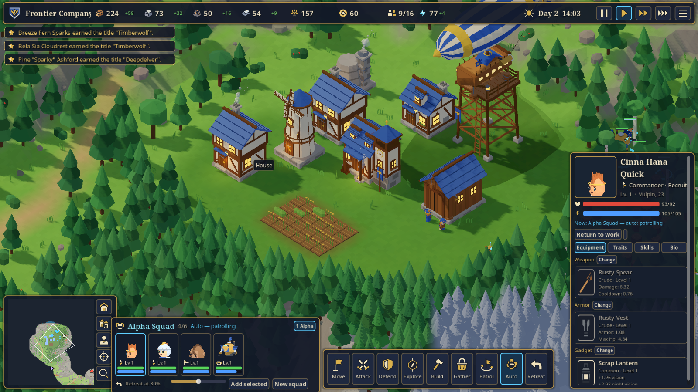

# Cogwild Frontier

手続き生成された永続オープンワールドを、住民・部隊・ロボット・ドローン・飛行船に指示を出しながら開拓していく、
RPG 要素のある自律型 RTS の **Playable Vertical Slice**（Godot 4.7 製）。
自分で部隊を動かしても、指示だけ出して眺めていても世界が進みます。
キャラチップ・肖像・建物・木や岩・地面・アイテムアイコン・タイトル画像は画像生成した絵で、3D の地形の上に置いています（手順は `docs/art_pipeline.md`）。
住民は種族 × 見た目 × 性別ごとに 2 種類の絵があり、同じ見た目の人が並びにくくなっています。
住民は RimWorld のように吹き出しでしゃべります（仕事の一言、近くの仲間との雑談、戦闘中のかけ声）。
UI は日本語 / 英語に対応しています。

**ブラウザで遊ぶ（PC・スマホ）: https://dma-cmyk.github.io/cogwild-frontier/**
（初回は約 60 MB のダウンロードがあります。2 回目からはブラウザのキャッシュで数秒。スマホは横向き推奨）



## 起動

```bash
./run.sh              # 初回は自動でインポートしてから起動
# または
godot --path game
```

必要なもの: Godot 4.7（`godot` コマンド）。レンダラーは Compatibility（OpenGL 3.3 / WebGL 2）で、ブラウザ版と同じ見た目になります（開発機は Intel Iris Xe）。

タイトル → **New frontier** で創設者（名前・種族・役割・見た目・会社名と旗の色・ワールドシード）を決めて開始。
同じシードなら同じ世界になります。**Continue / Load** でセーブから再開。

## 設定

タイトル画面またはゲーム中の Esc メニューの **設定 / Settings** で変更できます。設定は保存されます（ブラウザ版はブラウザ内に保存）。

| 項目 | 内容 |
|---|---|
| 言語 | 日本語 / English（タイトル画面右上の **Language / 言語** からも切り替え可） |
| BGM | 自動（タイトル・昼・夜・戦闘で切り替え）/ シャッフル / なし / 曲を固定（5 曲） |
| 音量 | 全体・音楽・効果音・環境音 |
| 画質 | 自動 / 低 / 中 / 高（自動はスマホで低、それ以外は中。高は MSAA と長い影） |
| UI サイズ | 自動 / 小 / 標準 / 大（自動は画面の大きさと画素密度から、スマホでも文字とボタンが読める大きさに） |
| 吹き出し | すべて / 戦闘のみ / なし |

起動時に固定する場合は環境変数 `COGWILD_LANG=ja|en`、または Godot のユーザー引数 `--lang=ja|en` を使います。

```bash
COGWILD_LANG=ja godot --path game
godot --path game -- --lang=en
```

人物名・地名・会社名など、手続き生成される固有名詞はラテン文字のまま表示されます。日本語表示には同梱した Noto Sans CJK JP のサブセットを使用します。ライセンスは `game/assets/fonts/LICENSE-NotoCJK.txt` を参照してください。


## 操作

| 入力 | 動作 |
|---|---|
| 左クリック / ドラッグ | 選択（ユニット・小隊・建物・拠点）/ 範囲選択 |
| 右クリック | 文脈命令: 地面へ移動 / 敵・敵拠点を攻撃 / 資源を採取（住民）/ 交易所へ交易（飛行船） |
| M F H X P Y U R | Move / Attack / Defend / Explore / Patrol / Escort / Auto / Retreat（小隊・選択ユニット） |
| B / G | 建設メニュー / 採取ゾーンと仕事の優先度 |
| 1–4, Tab | 小隊を選択 |
| W A S D・矢印・画面端・中ボタンドラッグ | カメラ移動 |
| ホイール | ズーム（カメラの向きは画像生成した建物の絵に合わせて固定） |
| Space / `[` `]` | 一時停止 / 速度（x1 x2 x4） |
| F5 / F9（ブラウザ版は Ctrl+S / Ctrl+L） | クイックセーブ / クイックロード |
| Esc / F1 | キャンセル・メニュー（セーブ 3 枠・ロード・設定）/ 操作説明 |

タッチ操作（スマホ・タブレット）:

| 操作 | 動作 |
|---|---|
| タップ | 選択（ユニット・建物・拠点・戦利品）。選択中に地面・敵をタップすると移動・攻撃などの文脈命令 |
| 1 本指ドラッグ / 2 本指ピンチ | カメラ移動 / ズーム |
| 長押し | 指の下にあるものの詳細 |
| 右上の **範囲選択** | オンの間はドラッグで範囲選択 |
| 右上の **マップ** / **詳細** | ミニマップ / 選択中の詳細パネルを開閉 |
| 命令ボタン（移動・攻撃・巡回など） | 次にタップした場所が目標 |
| 建設 | 建物を選び、場所をタップして **決定**（壁はドラッグか両端をタップ） |

縦向きでは横向きを勧める案内が出ます（「このまま続ける」で縦のまま遊べます）。タイトル画面の **全画面** でブラウザの全画面表示に切り替えられます。

## 遊び方の例

1. 最初から Alpha 小隊（創設者・護衛・弓兵・Walker）、住民 5 人、Work Bot、Scout Drone、飛行船がいます。
   住民は最初から伐採・採掘・畑を自分で回しています。
2. **Build**（B）で Windmill を建てると電力がプラスになり、ロボットの消費をまかなえます。House で人口上限が増え、移住者が来ます。
3. 小隊を選んで **Explore**（X）→ 地面をクリック。領域を調べ、遺跡の宝を拾い、強すぎる拠点を避けて、帰還時に報告します。
4. 見つけた盗賊の野営地は右クリック（または拠点パネル）で攻撃。倒すと装備や宝箱を落とします。
   キャラクター詳細の **Equipment → Change** で武器庫の品を装備できます。
5. 任せたいときは小隊を **Auto**（U）に。飛行船は詳細パネルの **Trade run / Auto** で交易所へ余剰を売りに行きます。

## 開発

```text
game/
  data/          JSON のゲームデータ（種族・役割・特性・技能・アイテム・ユニット・建物・生成規則）
  src/core/      DB（データ）・App（入力と画面遷移）・Sfx（音）・RngUtil・Caches
  src/world/     WorldGen（決定的なチャンク生成）・ChunkData・Tiles
  src/sim/       World（10 Hz tick）・ColonyAI・SquadAI・Combat・FactionAI・Economy・SaveGame・NewGame
  src/gen/       NpcGen・ItemGen・NameGen・NamedEnemyGen
  src/visual/    SpriteLibrary（画像生成の絵の検索）・SpriteUnitVisual・MeshKit（低ポリの代替表示）・LookDev・建物/小物/アイコン/VFX・シェーダー
  src/view/      Game（ループ・選択）・WorldView・ChunkView・UnitView・CameraRig・InputController
  src/ui/        HUD・情報パネル・小隊パネル・ミニマップ・建設メニュー・ポーズメニュー・タイトル
  tests/         ヘッドレステスト（test_*.gd）・ギャラリー・probe シナリオ
  tools/         world_map_dump（生成した世界を PNG に）
tools/art/       make_prompts.py（画像生成のプロンプト）・process.py（生成画像 → ゲーム用素材）・overrides.json
tools/audio/     compose_bgm.py（BGM 5 曲の手続き作曲 → OGG）
tools/web/       fetch_templates.py（Web 書き出しテンプレートの取得）・apply_import_presets.py（テクスチャ圧縮設定）・build_web.sh
.github/         workflows/pages.yml（main への push で Web 版を書き出して GitHub Pages に公開）
art_src/         prompts.json（生成リクエスト一覧）。raw/ は生成結果の原本（大きいので Git 管理外）
docs/            design.md（設計・仮定）、art_pipeline.md（画像生成アート）、contracts.md（モジュール境界）、screenshots/、samples/
```

テスト:

```bash
godot --headless --path game --import
godot --headless --path game res://tests/run_tests.tscn                          # 全部（長時間テスト含む）
godot --headless --path game res://tests/run_tests.tscn -- --filter=sim          # 一部だけ
```

実際に動かしての確認（ウィンドウあり、`~/.omp/agent/skills/game-production/scripts/godot_probe.py`）:

```bash
P=~/.omp/agent/skills/game-production/scripts/godot_probe.py
export COGWILD_LANG=en   # probe のクリック座標は英語 UI が前提
COGWILD_WORLD_SEED=7  python3 $P game --scenario game/tests/probe/explore_day.json    --godot-arg=--time-scale --godot-arg=4
COGWILD_WORLD_SEED=11 python3 $P game --scenario game/tests/probe/combat_camp.json    --godot-arg=--time-scale --godot-arg=4
python3 $P game --scenario game/tests/probe/build_windmill.json --godot-arg=--time-scale --godot-arg=4   # 世界はシナリオの乱数シードから
COGWILD_WORLD_SEED=7  python3 $P game --scenario game/tests/probe/save_load.json      --godot-arg=--time-scale --godot-arg=4
godot --headless --path game res://tools/world_map_dump.tscn -- --seed=123 --radius=6 --out=/tmp/map.png
```

`COGWILD_WORLD_SEED`（またはユーザー引数 `--world-seed=`）で世界を固定します。combat_camp は近くの野営地へ歩いて行ける世界（シード 11）が前提です。

Web 版（GitHub Pages と同じもの）をローカルで作って確かめる:

```bash
tools/web/build_web.sh                                   # テンプレート取得 → インポート → build/web/ に書き出し
python3 -m http.server -d build/web 8060 --bind 127.0.0.1  # http://127.0.0.1:8060/ を開く
```

スレッドなしの Web テンプレート（COOP/COEP ヘッダ不要）を使います。人物・建物などの絵は Basis Universal で 1 種類だけ配布し、読み込み時に GPU の形式（PC は BC 系、スマホは ASTC / ETC2）に変換します。

## 任意の AI 文章生成

ゲームは API なしで完結します。OpenAI 互換のエンドポイントを設定したときだけ、人物の一言・経歴と珍しい品のフレーバー文を
バックグラウンドで書き換えます（数値や挙動は変わりません）。キーはコードに置かず、環境変数で渡します。

```bash
COGWILD_AI_ENDPOINT=https://api.openai.com/v1/chat/completions COGWILD_AI_KEY=... COGWILD_AI_MODEL=... ./run.sh
```

## クレジット

- 人物・機械・建物・木や岩・地面・アイテムアイコン・タイトル画像は、画像生成モデル（OpenAI gpt-image-1、OMP の画像生成ツール経由）で作った絵を `tools/art/process.py` で加工したもの。プロンプトは `art_src/prompts.json`。
- 絵がないものの代替表示・UI アイコン・エフェクトはコードで手続き生成。
- 効果音・環境音は `audio_gen.py`、BGM 5 曲は `tools/audio/compose_bgm.py` による手続き生成（第三者素材なし、OGG Vorbis）。
- フォント: Noto Sans / Noto Serif（`game/assets/fonts/LICENSE-Noto.txt`）、日本語は Noto Sans CJK JP のサブセット（`CogwildCJK-*.otf`、`LICENSE-NotoCJK.txt`、いずれも SIL OFL 1.1）。
