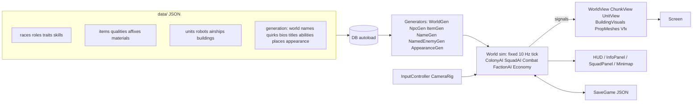

# Cogwild Frontier — 設計メモ

プレイしながら仕様を育てる前提の「現時点の正本」。細部はコードと `data/` が正。

## 1. Game Brief

| 項目 | 内容 |
|---|---|
| Pitch | 手続き生成された永続オープンワールドを、住民・部隊・ロボット・ドローン・飛行船に指示を出して開拓していく、RPG 要素のある自律型 RTS |
| Core loop | 指示（ゾーン・建設・部隊命令・委任）→ 住民/部隊/機械が自律実行 → 資源・発見・戦利品・成長 → 開拓地の拡大と新しい地域 → 次の指示 |
| 操作 | 左クリック選択・ドラッグ範囲選択・右クリック文脈命令（移動/攻撃/採取/交易）、コマンドバー（Move/Attack/Defend/Explore/Build/Gather/Patrol/Auto/Retreat）、WASD/端スクロール/ホイール/QE回転、Space と `[` `]` で速度。タッチはタップ選択・命令、ドラッグ移動、ピンチズーム・2本指ねじり回転、長押し詳細 |
| 目的 | クリアなし。探索・開拓・育成・戦利品で「世界と自勢力が育つ」こと自体が目的 |
| 勝敗 | 敗北条件なし（負傷→ダウン→回復/死亡、飢え、略奪などの後退はある） |
| 主要システム | チャンク生成の永続世界 / 住民の自律ジョブ / 部隊と委任 AI / 戦闘・戦利品 / NPC 生成と成長 / 敵勢力・商人・移住の世界シミュレーション / セーブ・ロード |
| 対象 | PC とブラウザ（スマホ含む。GitHub Pages）。Linux 開発機: Intel Iris Xe・1920×1080、Godot 4.7.2 Compatibility レンダラー（WebGL 2 と共通）、x1 で 60 FPS 目標 |
| 段階 | Vertical Slice（遊べる核の確認） |
| アート | 等角風の正射影カメラ（ピッチ −30°、ヨー 45°を基準に90°刻みで4方向回転）。画像生成した絵をカメラ正対のカードとして 3D 地形に置く（`docs/art_pipeline.md`）。暖色の光、青×クリーム×金の自勢力、赤の敵勢力 |

## 2. 参考画像の分析と反映

`docs/reference/visual_reference.png` から読み取ったもの:

| 観点 | 画像 | 反映 |
|---|---|---|
| カメラ | 高めの等角俯瞰、奥に山と遠景 | 正射影・ピッチ −30°（生成画像の 2:1 等角に合わせる）・ヨーは45°を基準に90°刻みで回転。建物の絵は4方向で必要なカード補正を行う |
| 密度・比率 | 自然 6：建物 4、森と崖に囲まれた盆地に村 | 開始地点は森・川に近い平坦地を採点で選ぶ。段丘の崖、川、湖、森を生成 |
| 建築 | 石の基礎・木骨の漆喰壁・青屋根、窓の灯り、旗、見張り台、飛行船ドック | 画像生成した建物の絵（全 30 種＋集会所 3 段階）。夜は窓や灯りの部分を自動で抽出して光らせる |
| 生身とロボットの共存 | 麦わら帽の農民、盾の兵士、真鍮の二脚メカ、青く光る目のドローン | 村人・兵士に加え Work Bot / Walker / Scout・Repair Drone を最初から配置 |
| 飛行船 | 青白ストライプの葉巻型気球＋木のゴンドラ | 初期の Cargo Airship（探索・交易・自動）、商人の緑の飛行船が来訪 |
| 陣営色 | 自勢力は青旗、敵は赤旗と煙の工業基地 | 自勢力 = 選択色（既定は青）、盗賊 = 赤、古代機械 = 青銅＋橙の発光 |
| UI | 上部資源バー（値と増減）、右上に日付と速度、左下ミニマップ＋縦ボタン、下中央に小隊パネル（肖像・Lv・HP/EN）とコマンドバー、右下にキャラ詳細（装備/特性/経歴） | ほぼ同じ配置で実装。肖像とアイテムアイコンは画像生成した絵 |
| 霧 | 周縁の雲 | 未探索地は青灰の霧（全シェーダー共通のフォグテクスチャ） |

画風: 最初は 3D の低ポリで作ったが、参考画像により近づけるため、描き込まれたドット絵風の絵を画像生成で作り、3D の世界に「カメラ正対の絵のカード」として置く方式に切り替えた（HD-2D に近い）。対象はキャラチップ、肖像、建物、木・岩・草花、地面テクスチャ、アイテムアイコン、タイトル画像。

- 地形の起伏・影・昼夜・霧・性能の仕組みはそのまま使っている。カメラはピッチ−30°を保ち、ヨーは90°刻みで回転できる。
- 建物は絵の各画素に壁の奥行きを持たせるので、前後関係が崩れない。
- 絵がないもの（未対応の機械の型など）は、手続き生成の低ポリに自動で戻る。

手順と仕組みは `docs/art_pipeline.md` を参照。

## 3. 置いた仮定（未指定だった点）

- UI 言語は英語と日本語（タイトル画面右上とポーズメニューで切り替え、設定を保存）。人名・地名などの固有名詞は生成されたラテン文字のまま。
- 1 日 = x1 で 4 分（昼 14 h 相当 3 分、夜 1 分）。速度は Pause / x1 / x2 / x4。
- 世界の広さは開始地点周辺 ±320 m（`data/generation/world.json` の `world_radius_chunks`）。チャンクは探索した方向に生成。
- 敗北なし。ダウンした仲間は敵がいなければ 25 秒で負傷状態で起き上がり、敵に囲まれ続けると 70 秒で死亡。
- 建設費は配置時に支払い、住民が倉庫から運んで建てる（キャンセルで返金）。
- 部隊は最大 6 人（参考画像の 6/6）。
- 自勢力の資源は全体共有（倉庫は配達先の意味のみ）。
- 食料は毎朝 1 人 1（特性で増減、料理の技能で最大 25% 節約）。
- AI API は任意（設定したときだけ文章を書き換える。§7）。ゲームは API なしで完結する。

## 4. アーキテクチャ

- **シミュレーションと表示の分離**: `src/sim`・`src/world` はノードを持たない。表示は状態を読み、シグナルで差分を受ける。
- **固定 tick（0.1 s）**: 速度は 1 フレームあたりの tick 数で変える。同じ seed と命令なら同じ結果（テストで確認）。
- **決定的な生成**: 地形・資源・拠点配置は (seed, 座標) の純関数。セーブには「変更差分」（伐採・畑・基礎の整地・探索済みマップ）と全エンティティだけを保存。
- **チャンク**: 32×32 m。探索したタイルの周囲 1 チャンクを先行生成。経路探索は AStarGrid2D（地形コスト付き、木は通過可・岩は不可）。
- **LOD / 軽量化**: 遠い拠点の守備隊は休眠（日次の成長だけ進む）、飛行ユニットは経路探索なし、樹木・岩は MultiMesh、草花・橋は地形メッシュに結合、カメラから遠いチャンクは非表示、影距離 100 m。
- **拠点表示**: シミュレーション状態はサイト生成時に即時確定し、`BuildingVisual` ノードは `WorldView` で 1 フレームに 1 棟ずつ構築してチャンク読み込みのスパイクを抑える。
- **外見 DNA**: キャラ・ロボ・ドローン・飛行船・アイテムが JSON の DNA を持ち、同じ DNA から同じ形を再構築（`AppearanceGen` → `UnitVisualFactory` / `Icons.item_icon`）。

## 5. 内容を増やすには（データ駆動）

`DB` は `data/<category>/*.json` を全部読み、id が同じなら後のファイルが上書きする。ファイルを置くだけで追加できる。

| 追加したいもの | 置き場所 | 形式 |
|---|---|---|
| 種族・役割・特性・技能 | `data/races` `data/roles` `data/traits` `data/skills` | id 付きオブジェクトの配列 |
| アイテム土台・素材・品質・接辞 | `data/items`（`{"table": "materials", "entries": [...]}` など） | 同上 |
| ユニット（人・ロボ・ドローン・飛行船） | `data/units` `data/robots` `data/airships` | `base` の能力値、`weapon`、`cost` 等 |
| 建物 | `data/buildings` | `size` `cost` `work` `housing` `storage` 等（見た目は `BuildingVisuals` に型を追加） |
| 名前・癖・経歴・称号・固有能力・地名 | `data/generation/*.json` | 文字列リスト / テンプレート |
| 世界生成の規則 | `data/generation/world.json` | ノイズ周波数、植生密度、拠点の種類と距離 |

## 6. 主要システムの挙動

- **住民**: ゾーン（伐採・採掘・採集・畑）と建設現場・工房から候補を集め、優先度 × 技能 × 距離で選んで予約 → 実行 → 倉庫へ運搬。夜と疲労で家に帰って休む。技能は使うほど上がり（適性で速度が違う）、レベル・称号がつく。
- **部隊**: Move / Attack（敵・拠点・地点）/ Defend / Explore（領域を調べ尽くして戦利品を拾い報告して帰還、強い拠点は避ける）/ Patrol / Escort / Retreat / Auto（本拠地防衛 → 回復 → 弱い拠点の掃討 → 探索 → 巡回）。撤退閾値を下回ると帰還して回復後に再開。

- **川・崖の横断**: 生身の歩行ユニットと軽量な二脚機械は、川を遅く渡渉し、崖をゆっくり登れる。自然湖の水は通れない。車輪・履帯・重機械は渡渉と登攀ができず、橋・階段を使う。橋区間（木材 12・石 2）は川タイルを道路速度で通し、崖階段区間（木材 8・石 6）は崖タイルを速く通す。両方とも住民が資材を運び建設し、セーブに保存される。探索済みで対象地形が正しければ、自勢力の建設可能範囲外でも配置できる。区間はドラッグ線または両端タップで連続配置できる。
- **機械**: Work Bot は住民と同じ仕事（休まない・電力消費）、Walker は部隊の重火力、Scout Drone は自動偵察、Repair Drone は回復、Cargo Airship は探索・交易・自動。工房で電力と金属から生産。
- **世界**: 盗賊の拠点は巡回し、数日ごとに略奪隊を送り、3 日ごとに成長（テント増設・兵の追加）し、掃討後 6 日で再占拠されうる。機械拠点は歩哨を再建。商人の飛行船がドックに来て余剰を買い、品物を売る。空き家と食料があれば移住者が来る。放浪者の野営地に近づくと仲間になる。
- **戦利品**: 品質 8 段階（junk〜anomalous）、大半は普通品。レア以上は光の柱と通知。

## 7. 拡張点

- **Optional AI Enrichment Layer**（`src/gen/ai_enrichment.gd`）: 生成器（Procedural Generator）が先に全文をローカル生成し、
  その後ろに任意の書き換え層がある構成。OpenAI 互換の chat-completions エンドポイントを設定したときだけ、
  新しく出会った人物の一言（bio）と経歴、珍しいアイテムのフレーバー文をバックグラウンドで書き換える。
  書き換えるのは文章だけなので、シミュレーションの決定性とセーブ互換性は変わらない。未設定なら何もしない。
  設定はコードに置かず、環境変数 `COGWILD_AI_ENDPOINT` / `COGWILD_AI_KEY` / `COGWILD_AI_MODEL` か
  `user://ai_enrichment.cfg` の `[ai]` セクション（endpoint / key / model）。
  テストはローカルのモックサーバー（`tests/mock_ai_server.py`）で実際に HTTP 往復して確認している。
- **Named Enemy / Boss**: `NamedEnemyGen` が土台・装備・能力・特性・名前・戦利品を組み合わせて生成し、各野営地の頭目と機械拠点の Warden に使用中。固有能力の種類（buff_allies/buff_self/heal_self/multi_shot）はデータで追加できる。
- **態勢・隊形**（`Squad.stance` / `Squad.formation`、`SquadAI._slot()` / `_engage()`）: 小隊パネルで選ぶ。
  - 態勢: 攻勢（遠くから交戦し、追撃し、撤退が遅い）/ 均衡（既定）/ 慎重（射手は射程を保って引き撃ち、近接が射手を守り、早めに撤退し、逃げる敵を追わない）/ 防衛（命令地点から 6 m 以内の敵とだけ戦う）。
  - 隊形: 横列 / 楔形 / 散開。近接は脅威の方向の前列、射手・支援は後列に入る。同じ目標を狙うときは別々の角度から囲み、1 点に重ならない。
- **役割の技**（`data/generation/tactics_abilities.json`）: 各ユニットのクールダウンで自動発動する。盾打ち（短い気絶）、狙い撃ち（1.2 秒の溜め・被弾で中断・1.5 倍）、爆破チャージ（範囲ダメージ）、野戦手当（味方を回復・ダウンからの復帰を早める）、鼓舞の号令（周囲の味方を強化）。敵（盗賊・機械・固有敵）も同じ規則で使う。
- **位置の効果**: 相手の正面の外から、または既に 2 人以上と戦っている相手を攻撃すると側面攻撃（命中とダメージが上がる）。木や岩の近くにいると射撃が当たりにくい（遮蔽）。どちらも浮き文字と吹き出しで出る。
- 態勢・隊形・技のクールダウンと溜めの状態はセーブされる。古いセーブは 均衡 / 横列 で読み込む。
