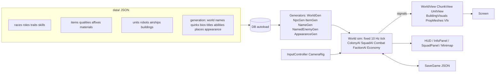

# Cogwild Frontier — 設計メモ

プレイしながら仕様を育てる前提の「現時点の正本」。細部はコードと `data/` が正。

## 1. Game Brief

| 項目 | 内容 |
|---|---|
| Pitch | 手続き生成された永続オープンワールドを、住民・部隊・ロボット・ドローン・飛行船に指示を出して開拓していく、RPG 要素のある自律型 RTS |
| Core loop | 指示（ゾーン・建設・部隊命令・委任）→ 住民/部隊/機械が自律実行 → 資源・発見・戦利品・成長 → 開拓地の拡大と新しい地域 → 次の指示 |
| 操作 | 左クリック選択・ドラッグ範囲選択・右クリック文脈命令（移動/攻撃/採取/交易/ダンジョン/階段）。命令の宛先は選択したもの: 小隊の隊員を選べばその小隊、小隊に属さないユニット（住民・ドローン・飛行船）を選べばそのユニット、何も選んでいなければ小隊パネルに出ている小隊（または全小隊）。右下の命令バー（建設・採集 ｜ Move/Attack/Defend/Explore/Patrol/Escort/Auto/Retreat/Stop ｜ 技）で命令する。命令の対象範囲は指定中も発令後も地面とミニマップに出したままにし、Stop（L）で対象選びと進行中の命令のどちらも取り消せる。WASD/端スクロール/ホイール/QE回転、1–9 で小隊、Space と `[` `]` で速度。Esc は対象選びの取り消し（選択は保つ）→ 小窓を閉じる → メニュー |
| 目的 | クリアなし。探索・開拓・育成・戦利品で「世界と自勢力が育つ」こと自体が目的 |
| 勝敗 | 敗北条件なし（負傷→ダウン→回復/死亡、飢え、略奪などの後退はある） |
| 主要システム | チャンク生成の永続世界 / 住民の自律ジョブ / 部隊と委任 AI / ダンジョン遠征 / 巨大な敵 / 戦闘・戦利品・鍛造 / NPC 生成と成長 / 敵勢力・商人・移住の世界シミュレーション / セーブ・ロード |
| 対象 | PC とPCブラウザ（GitHub Pages）。スマホ・タブレット対応は対象外。Web はタイトル到達・初回プレイ用の core pack を先に配布し、追加アートはゲーム開始後に別パックとして取得・キャッシュする。Linux 開発機: Intel Iris Xe・1920×1080、Godot 4.7.2 Compatibility レンダラー（WebGL 2 と共通）、x1 で 60 FPS 目標 |
| 段階 | Vertical Slice（遊べる核の確認） |
| アート | 等角風の正射影カメラ（ピッチ −30°、ヨー 45°を基準に90°刻みで4方向回転）。画像生成した絵をカメラ正対のカードとして 3D 地形に置く（`docs/art_pipeline.md`）。暖色の光、青×クリーム×金の自勢力、赤の敵勢力 |

## 2. 参考画像の分析と反映

`docs/reference/visual_reference.png` から読み取ったもの:

| 観点 | 画像 | 反映 |
|---|---|---|
| カメラ | 高めの等角俯瞰、奥に山と遠景 | 正射影・ピッチ −30°（生成画像の 2:1 等角に合わせる）・ヨーは45°を基準に90°刻みで回転。建物の絵は4方向で必要なカード補正を行う |
| 密度・比率 | 自然 6：建物 4、森と崖に囲まれた盆地に村 | 開始地点は森・川に近い平坦地を採点で選ぶ。段丘の崖、川、湖、森を生成 |
| 建築 | 石の基礎・木骨の漆喰壁・青屋根、窓の灯り、旗、見張り台、飛行船ドック | 画像生成した建物の絵（全 30 種＋集会所 3 段階）。夜は窓や灯りの部分を自動で抽出して光らせる |
| 生身とロボットの共存 | 麦わら帽の農民、盾の兵士、真鍮の二脚メカ、青く光る目のドローン | 村人・兵士に加え Work Bot / Walker / Scout・Repair Drone を最初から配置 |
| 飛行船 | 青白ストライプの葉巻型気球＋木のゴンドラ | 初期の Cargo Airship（探索・交易・自動）、商人の緑の飛行船が来訪 |
| 陣営色 | 自勢力は青旗、敵は赤旗と煙の工業基地 | 自勢力 = 選択色（既定は青）、盗賊 = 赤、古代機械 = 青銅＋橙の発光 |
| UI | 上部資源バー（値と増減）、右上に日付と速度、左下ミニマップ＋縦ボタン、下中央に小隊パネル（肖像・Lv・HP/EN）とコマンドバー、右下にキャラ詳細（装備/特性/経歴） | 左下ミニマップの右に小隊パネル（顔カード・態勢・隊形・隊員の出し入れ・名前）、右下に命令バー、その上にキャラ詳細。肖像とアイテムアイコンは画像生成した絵 |
| 霧 | 周縁の雲 | 未探索地は青灰の霧（全シェーダー共通のフォグテクスチャ） |
| 地面のしるし | — | 選択と命令の範囲は `OrderMarkers` が作る「地面に置いた光の帯」で描く。ふちを頂点カラーでぼかした細い帯（芯 0.22 m ＋ 減衰 0.17 m）で、地形の高さを 1.5 m ごとに拾って起伏に沿う。歩く道すじは破線、囲う範囲・敷地の枠は実線、ユニットの足もとは同じ形の輪（`OrderMarkers.unit_mark`、トーラスの輪は絵のキャラの下で太い管に見えるため置き換えた） |

画風: 最初は 3D の低ポリで作ったが、参考画像により近づけるため、描き込まれたドット絵風の絵を画像生成で作り、3D の世界に「カメラ正対の絵のカード」として置く方式に切り替えた（HD-2D に近い）。対象はキャラチップ、肖像、建物、木・岩・草花、地面テクスチャ、アイテムアイコン、タイトル画像。

- 地形の起伏・影・昼夜・霧・性能の仕組みはそのまま使っている。カメラはピッチ−30°を保ち、ヨーは90°刻みで回転できる。
- 建物は絵の各画素に壁の奥行きを持たせるので、前後関係が崩れない。
- 絵がないもの（未対応の機械の型など）は、手続き生成の低ポリに自動で戻る。

手順と仕組みは `docs/art_pipeline.md` を参照。

## 3. 置いた仮定（未指定だった点）

- UI 言語は英語と日本語（タイトル画面右上とポーズメニューで切り替え、設定を保存）。人名・地名などの固有名詞は生成されたラテン文字のまま。
- 1 日 = x1 で 4 分（昼 14 h 相当 3 分、夜 1 分）。速度は Pause / x1 / x2 / x4。
- 世界の広さは開始地点周辺 ±320 m（`data/generation/world.json` の `world_radius_chunks`）。チャンクは探索した方向に生成。
- 敗北なし。ダウンした仲間は敵がいなければ 25 秒で負傷状態で起き上がり、敵に囲まれ続けると 70 秒で死亡。
- 建設費は配置時に支払い、住民が倉庫から運んで建てる（キャンセルで返金）。
- 部隊は最大 9 小隊（1–9 キー）、各小隊は最大 6 人。空の小隊も作成・保存・解散でき、「＋ New squad」は選択中の対象を編入し、対象がなければ空小隊を作って複数選択の隊員選びを開く。
- 自勢力の資源は全体共有（倉庫は配達先の意味のみ）。
- 食料は毎朝 1 人 1（特性で増減、料理の技能で最大 25% 節約）。
- AI API は任意（設定したときだけ文章を書き換える。§7）。ゲームは API なしで完結する。

## 4. アーキテクチャ

- **シミュレーションと表示の分離**: `src/sim`・`src/world` はノードを持たない。表示は状態を読み、シグナルで差分を受ける。
- **固定 tick（0.1 s）**: 速度は 1 フレームあたりの tick 数で変える。同じ seed と命令なら同じ結果（テストで確認）。
- **決定的な生成**: 地形・資源・拠点配置は (seed, 座標) の純関数。セーブには「変更差分」（伐採・畑・基礎の整地・探索済みマップ）と全エンティティだけを保存。
- **チャンク**: 32×32 m。探索したタイルの周囲 1 チャンクを先行生成。経路探索は AStarGrid2D（地形コスト付き、木は通過可・岩は不可）。
- **LOD / 軽量化**: 遠い拠点の守備隊は休眠（日次の成長だけ進む）、飛行ユニットは経路探索なし、樹木・岩は MultiMesh、草花・橋は地形メッシュに結合、カメラから遠いチャンクは非表示、影距離 100 m。
- **拠点表示**: シミュレーション状態はサイト生成時に即時確定し、`BuildingVisual` ノードは `WorldView` で 1 フレームに 1 棟ずつ構築してチャンク読み込みのスパイクを抑える。
- **外見 DNA**: キャラ・ロボ・ドローン・飛行船・アイテムが JSON の DNA を持ち、同じ DNA から同じ形を再構築（`AppearanceGen` → `UnitVisualFactory` / `Icons.item_icon`）。
- **地下と地上の同時進行**: `World` は1つ。新規世界の端に `DungeonZone` の専用区画を予約し、36×36の各階を岩の壁と4マスの間隔で分離する。入口・階段だけで転送し、移動・戦闘・回収は同じマップ内に限定する。地上の飛行経路も専用区画を迂回する。これにより地上の経済や住民を止めず、別の `World`・ID・セーブ系を重複して持たない。旧セーブには区画を予約しない。
- **管理画面**: 上部の履歴・生産・交易・場所から、既存のシミュレーション状態を読む画面を開く。開閉で時間速度は変更しない。履歴は最新500件をセーブし、閲覧中の新着は明示更新にまとめる。生産表示と選択詳細は同じ計算を共有し、交易方法は3タブに分ける。場所一覧とミニマップは発見済みの地上地点と自軍施設だけを扱い、選択・表示と命令を区別する。

## 5. 内容を増やすには（データ駆動）

`DB` は `data/<category>/*.json` を全部読み、id が同じなら後のファイルが上書きする。ファイルを置くだけで追加できる。

| 追加したいもの | 置き場所 | 形式 |
|---|---|---|
| 種族・役割・特性・技能 | `data/races` `data/roles` `data/traits` `data/skills` | id 付きオブジェクトの配列 |
| アイテム土台・素材・品質・接辞 | `data/items`（`{"table": "materials", "entries": [...]}` など） | 同上 |
| ユニット（人・ロボ・ドローン・飛行船） | `data/units` `data/robots` `data/airships` | `base` の能力値、`weapon`、`cost` 等 |
| 建物 | `data/buildings` | `size` `cost` `work` `housing` `storage` 等（見た目は `BuildingVisuals` に型を追加） |
| 名前・癖・経歴・称号・固有能力・地名 | `data/generation/*.json` | 文字列リスト / テンプレート |
| 世界生成の規則 | `data/generation/world.json` | ノイズ周波数、植生密度、拠点の種類と距離 |

## 6. 主要システムの挙動

- **住民**: ゾーン（伐採・採掘・採集・畑）と建設現場・工房から候補を集め、優先度 × 技能 × 距離で選んで予約 → 実行 → 倉庫へ運搬。夜と疲労で家に帰って休む。技能は使うほど上がり（適性で速度が違う）、レベル・称号がつく。
- **部隊**: 最大 9 小隊。Move / Attack（敵・拠点・地点）/ Defend / Explore（領域を調べ尽くして戦利品を拾い報告して帰還、強い拠点は避ける）/ Patrol / Escort / Retreat / Auto（本拠地防衛 → 回復 → 弱い拠点の掃討 → 探索 → 巡回）。撤退閾値を下回ると帰還して回復後に再開。小隊タブの「＋ New squad」は常に表示し、選択中の対象（最大6人）を編入するか、空小隊を作って隊員ピッカーを開く。ピッカーは複数選択・他小隊からの移籍・残り枠表示に対応する。

- **川・崖の横断**: 生身の歩行ユニットと軽量な二脚機械は、川を遅く渡渉し、崖をゆっくり登れる。自然湖の水は通れない。車輪・履帯・重機械は渡渉と登攀ができず、橋・階段を使う。橋区間（木材 12・石 2）は川タイルを道路速度で通し、崖階段区間（木材 8・石 6）は崖タイルを速く通す。両方とも住民が資材を運び建設し、セーブに保存される。探索済みで対象地形が正しければ、自勢力の建設可能範囲外でも配置できる。区間はドラッグ線または両端タップで連続配置できる。
- **機械**: Work Bot は住民と同じ仕事（休まない・電力消費）、Walker は部隊の重火力、Scout Drone は自動偵察、Repair Drone は回復、Cargo Airship は探索・交易・自動。工房で電力と金属から生産。
- **世界**: 盗賊の拠点は巡回し、数日ごとに略奪隊を送り、3 日ごとに成長（テント増設・兵の追加）し、掃討後 6 日で再占拠されうる。機械拠点は歩哨を再建。商人の飛行船がドックに来て余剰を買い、品物を売る。空き家と食料があれば移住者が来る。放浪者の野営地に近づくと仲間になる。
- **戦利品**: 品質 8 段階（junk〜anomalous）、大半は普通品。レア以上は光の柱と通知。
- **ダンジョン**: 2日目に最初の入口、その後は日ごとに50%の確率で増える（同時4つまで）。地上全域のランダムな歩ける平地に出る。難易度1〜5と5テーマ（盗賊・ゴブリン・爬虫人・獣人・機械）を持ち、階数は順に2〜3 / 3〜4 / 4〜6 / 6〜8 / 8〜10。敵の階レベルは `max(1, 2*難易度-1+階番号)`（階番号は0始まり）。入口・階の状態と敵・宝・探索状況を保存する。未訪問30日、放棄60日、討伐後8日で閉じ、空いた区画は次の入口に使う。
- **遠征命令**: 入口に歩いて入る。階段に歩いて上り下りする。攻略（地下での Auto / Explore）は敵を倒し、回収できる戦利品を拾い、次の階に降り、最下層の主を倒したら階段を上って地上へ帰る。撤退も階段を使う。明示的な移動は反撃より優先し、予兆範囲から逃げられる。飛行敵のドロップは近くの地面に落とし、到達不能な袋で回収処理を止めない。
- **巨大な敵**: 体の半径を経路・攻撃距離・選択輪・HPバーに反映し、1マスの戸口を通り抜けられない。主は最下層の大部屋を守り、予兆のある範囲攻撃と最大4体の守兵召喚を使う。体力半分以下で攻撃力が上がり、技の間隔が短くなる。巨獣は2日目以降、入植地から離れた場所に1体出る。縄張りを徘徊し、近くの相手を追い、遠ざかると戻る。自勢力の建物から42m以内を追跡・経路の対象にしない。
- **生成装備と固有戦利品**: 品質・素材・レベルはダメージ/装甲/HP/運搬/出力を伸ばし、射程・命中率・攻撃間隔は土台の値を保つ。接辞の効果は土台と合算する。主はテーマ固有装備と鍛造素材を保証し、固有装備の最低品質は難易度順に rare / rare / epic / legendary / anomalous。通常の宝箱からも低確率でテーマ装備が出る。巨獣は再生と移動速度の装備、角を落とす。
- **鍛造・強化・分解・修理**: 完成した工房か利用できる町の鍛冶屋で行う。核・角1個と金属18・金貨45から固有装備を鍛造。強化は+3まで、主能力と修飾効果を1回ごとに1.1倍（代償の効果も拡大）。武器庫の未装備品は分解して金属に戻す。武器は攻撃、防具は被弾で摩耗し、0%でも壊れず威力/装甲が最大50%低下する。修理すると100%に戻る。費用不足や上限到達では品・素材とも変化させず、装備中の強化・修理は実ステータスへ即時反映する。
- **種族の村**: 探索すると種族別の村（中央 hall、3–6 軒の home、畑・屋台・装飾、5–10 人の住民）が見つかる。村人には労働者・護衛・長老がおり、遠距離では日次処理だけを行う。
- **外交・交易**: 村ごとに −100..100 の関係値（Hostile / Wary / Neutral / Friendly / Allied）を保存する。交易・贈り物・依頼達成・防衛で上がり、攻撃・依頼無視で下がり、毎日基準値へ戻る。同種族の村にも一部が伝播する。Neutral 以上で村にプレイヤー部隊を立たせると交易でき、資源と種族特産品の在庫は毎朝更新される（売値は買値より低く、関係 tier で価格が変化）。
- **村への攻撃と略奪**: 非敵対村への攻撃は確認を要求する。守備隊が倒れると村は subdued になり、備蓄と既存 loot bag 由来の戦利品 cache を回収できる。数日間 ruins となった後、人口を減らして復興し、和平（貢納）まで敵対する。

## 7. 拡張点

- **Optional AI Enrichment Layer**（`src/gen/ai_enrichment.gd`）: 生成器（Procedural Generator）が先に全文をローカル生成し、
  その後ろに任意の書き換え層がある構成。OpenAI 互換の chat-completions エンドポイントを設定したときだけ、
  新しく出会った人物の一言（bio）と経歴、珍しいアイテムのフレーバー文をバックグラウンドで書き換える。
  書き換えるのは文章だけなので、シミュレーションの決定性とセーブ互換性は変わらない。未設定なら何もしない。
  設定はコードに置かず、環境変数 `COGWILD_AI_ENDPOINT` / `COGWILD_AI_KEY` / `COGWILD_AI_MODEL` か
  `user://ai_enrichment.cfg` の `[ai]` セクション（endpoint / key / model）。
  テストはローカルのモックサーバー（`tests/mock_ai_server.py`）で実際に HTTP 往復して確認している。
- **Named Enemy / Boss**: `NamedEnemyGen` が土台・装備・能力・特性・名前・戦利品を組み合わせて生成し、各野営地の頭目と機械拠点の Warden に使用中。固有能力の種類（buff_allies/buff_self/heal_self/multi_shot）はデータで追加できる。
- **態勢・隊形**（`Squad.stance` / `Squad.formation`、`SquadAI._slot()` / `_engage()`）: 小隊パネルで選ぶ。
  - 態勢: 攻勢（遠くから交戦し、追撃し、撤退が遅い）/ 均衡（既定）/ 慎重（射手は射程を保って引き撃ち、近接が射手を守り、早めに撤退し、逃げる敵を追わない）/ 防衛（命令地点から 6 m 以内の敵とだけ戦う）。態勢が決めるのは「自分から仕掛ける範囲」だけで、プレイヤーが出した攻撃命令には掛からない（防衛の小隊も名指しした相手は追う）。
  - 隊形: 横列 / 楔形 / 散開。近接は脅威の方向の前列、射手・支援は後列に入る。同じ目標を狙うときは別々の角度から囲み、1 点に重ならない。
- **役割の技**（`data/generation/tactics_abilities.json`）: 既定では各ユニットのクールダウンで自動発動する。小隊の「技を自動使用」を切ると手動だけになり、命令バーの技ボタン（Z C V T N J K O I）で `Combat.use_ability()` を呼ぶ（対象が要る技は続けてクリック、射程外なら近づいてから使う、新しい命令で取り消し）。盾打ち（短い気絶）、狙い撃ち（1.2 秒の溜め・被弾で中断・1.5 倍）、爆破チャージ（範囲ダメージ）、野戦手当（味方を回復・ダウンからの復帰を早める）、鼓舞の号令（周囲の味方を強化）。敵（盗賊・機械・固有敵）も同じ規則で使う。小隊の上には態勢の旗が立ち、防衛では守る範囲の輪が出る。
- **位置の効果**: 相手の正面の外から、または既に 2 人以上と戦っている相手を攻撃すると側面攻撃（命中とダメージが上がる）。木や岩の近くにいると射撃が当たりにくい（遮蔽）。どちらも浮き文字と吹き出しで出る。
- 態勢・隊形・技のクールダウンと溜めの状態はセーブされる。古いセーブは 均衡 / 横列 で読み込む。
